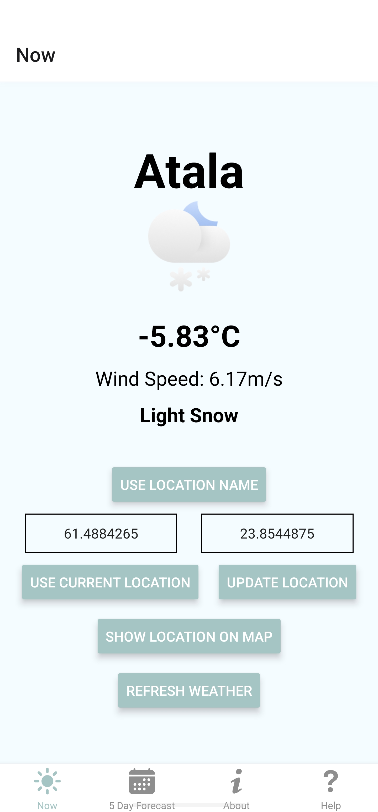
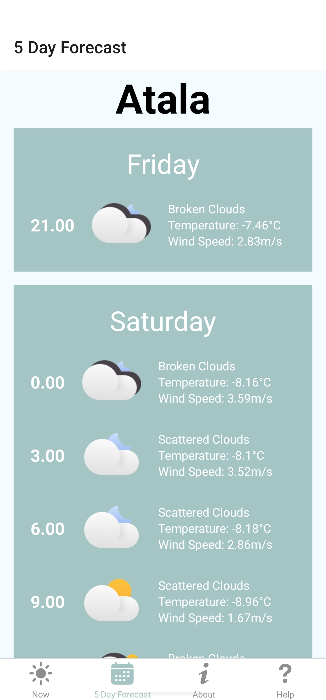

# Weather App

<p align="center">
    
    
</p>

This is a cross-platform mobile application built with React Native. It provides real-time weather information based on your current location or a location you specify.

## Features

- Display current weather information including temperature, wind speed, and weather description.
- Display weather icon based on the current weather condition.
- Allow users to manually input a location to get the weather information.
- Provide a daily weather forecast.
- Provide an about page with information about the app.
- Provide a help page with useful links and information.

## Getting Started

### Prerequisites

- Node.js
- npm
- Expo CLI

### Installation

1. Clone the repo
   ```sh
   git clone https://github.com/your-username/your-repo-name.git
   ```
2. Install NPM packages
   ```sh
   npm install
   ```
3. Start the Expo server
   ```sh
   npm start
   ```

### Usage

Once you have the app running, you can navigate between the "Now", "5 Day Forecast", "About", and "Help" tabs. The "Now" tab will display the current weather information based on your location. The "5 Day Forecast" tab will display the daily weather forecast. The "About" tab provides information about the app. The "Help" tab provides useful links and information.

## Tech Stack

- Frontend: React Native
- Backend: OpenWeatherMap API
- Design Tools: Expo, React Native Paper

## Acknowledgements

- React Native
- Expo
- OpenWeatherMap API